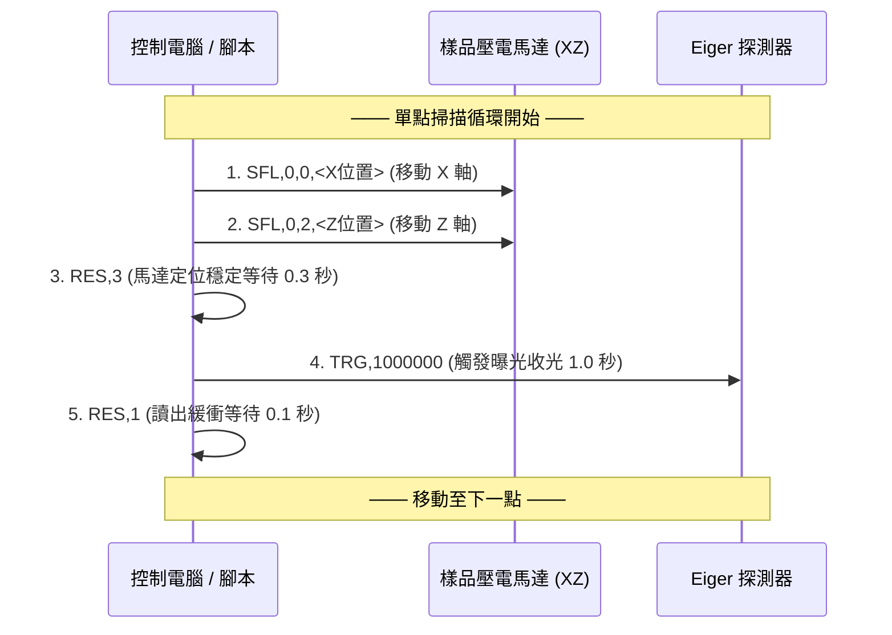

# TPS 25A 費馬螺線（Fermat Spiral）掃描系統操作手冊

本文件詳細說明用於 X 光疊代相襯成像（Ptychography）的 **費馬螺線（Fermat Spiral）掃描控制指令協議**、**座標換算機制** 以及 **自動化指令生成腳本** 的使用方法。

---

## 1. 掃描原理與特點

費馬螺線（Fermat's Spiral / Vogel Model）是一種基於黃金角（$\phi \approx 137.508^\circ$）的空間分佈採樣方式：
- **消除網格偽影**：傳統矩形網格（Grid Scan）在 Ptychography 重構時容易在倒易空間產生週期性格點偽影，費馬螺線能有效破除週期性對稱。
- **均勻覆蓋密度**：半徑隨點數平方根（$r \propto \sqrt{n}$）增長，保證每點佔據相等的局部面積。
- **正方形裁切（Square Cropping）**：先以外接圓生成候選點，再自動裁切保留於指定的正方形（$x_{\text{range}} \times z_{\text{range}}$）範圍內。

```
       Z 軸 (垂直)
         ▲
         │      ┌─────────────────┐
         │      │  •   •   •   •  │
         │      │•   •   •   •   •│  正方形掃描區域 (range x range)
         │──────│───•────X────•───│────────► X 軸 (水平)
         │      │•   • (cenX,cenZ)│
         │      │  •   •   •   •  │
         │      └─────────────────┘
         │
       光軸 Y 軸 (X光束前進方向 ⊙)
```

---

## 2. 馬達控制器指令協議規範

掃描指令輸出為標準純文字檔（`.txt`），每一行代表一個動作指令。

| 指令 | 參數語法 | 參數意義 | 單位 / 說明 |
| :--- | :--- | :--- | :--- |
| **`STR`** | `STR` | 掃描開始標記 | 必須位於檔案第一行（無 `>` 符號） |
| **`SFL`** | `SFL,0,<軸代號>,<位置>` | 樣品軸絕對位置移動 | • 軸代號：`0` = X 軸，`1` = Y 光軸，`2` = Z 軸<br>• 位置單位：**$1\text{ nm} = 1,000,000\ (10^6)\text{ 單位}$** |
| **`RES`** | `RES,<時間單位>` | 延遲等待 / 休息 | **單位為 $0.1\text{ 秒}$**（例如 `RES,3` = 0.3 秒，`RES,1` = 0.1 秒） |
| **`TRG`** | `TRG,<曝光時間>` | 觸發 Detector 收光 | **單位為微秒（$\mu s$）**（例如 `TRG,1000000` = 1.0 秒） |
| **`END`** | `END` | 掃描結束標記 | 必須位於檔案最後一行 |

---

## 3. 單位換算公式

### 3.1 馬達位置座標（SFL）
- **輸入設定**：預設以微米（$\mu m$）為單位（如 `cenx=50.0`, `range=1.0`, `step=0.1`）。
- **換算倍率**：
  $$1\ \mu m = 1,000\text{ nm} = 1,000 \times 1,000,000 = 1,000,000,000\ (10^9)\text{ SFL 單位}$$
- **計算公式**：
  $$\text{SFL 數值} = \text{round}\big(\text{位置}(\mu m) \times 10^9\big)$$
- **範例**：
  - $50.0\ \mu m \longrightarrow 50 \times 10^9 = \mathbf{50000000000}$（500 億）
  - $49.9263\ \mu m \longrightarrow \mathbf{49926300000}$

### 3.2 時間單位
- **定位等待（`RES`）**：$0.3\text{ 秒} \div 0.1\text{ 秒} = \mathbf{3}$
- **收光等待（`RES`）**：$0.1\text{ 秒} \div 0.1\text{ 秒} = \mathbf{1}$
- **曝光時間（`TRG`）**：$1.0\text{ 秒} = \mathbf{1000000\ \mu s}$（$10^6$ 微秒）

---

## 4. 單點標準動作時序（Step Sequence）

每一個掃描點位均依序執行以下 5 個步驟：



---

## 5. 指令生成腳本使用指南

腳本路徑：`Z:\TPS23A_USER\Ptychography\generate_fermat_scan_cmd.py`

### 5.1 命令列參數說明

| 參數 | 說明 | 預設值 | 範例 |
| :--- | :--- | :--- | :--- |
| `--cenx` | X 軸中心座標（$\mu m$） | `50.0` | `--cenx 50.0` |
| `--cenz` | Z 軸中心座標（$\mu m$） | `50.0` | `--cenz 50.0` |
| `--range` | 正方形邊長範圍（$\mu m$） | `1.0` | `--range 1.0` |
| `--step` | 點間距步長（$\mu m$） | `0.1` | `--step 0.1` |
| `--trg` | 探測器曝光時間（$\mu s$） | `1000000` (1s) | `--trg 1000000` |
| `--rest_before` | 定位後等待時間（單位 0.1s） | `3` (0.3s) | `--rest_before 3` |
| `--rest_after` | 收光後等待時間（單位 0.1s） | `1` (0.1s) | `--rest_after 1` |
| `--axis_x` | X 軸代號 | `0` | `--axis_x 0` |
| `--axis_z` | Z 軸代號 | `2` | `--axis_z 2` |
| `--output` | 輸出文字檔路徑 | `fermat_scan_commands.txt` | `--output scan.txt` |
| `--plot` | 輸出預覽圖路徑 | `fermat_scan_path.png` | `--plot scan.png` |

---

### 5.2 常用執行範例

#### 範例 1：標準 Case 1 掃描（中心 50,50，範圍 1um，步長 0.1um，曝光 1s）
```powershell
python Z:\TPS23A_USER\Ptychography\generate_fermat_scan_cmd.py --cenx 50.0 --cenz 50.0 --range 1.0 --step 0.1 --trg 1000000 --output Z:\TPS23A_USER\Ptychography\fermat_scan_commands.txt
```
*(此配置將生成 **34 個點**，共 172 行控制指令)*

#### 範例 2：較大範圍掃描（中心 50,50，範圍 2.5um，步長 0.15um，曝光 0.5s）
```powershell
python Z:\TPS23A_USER\Ptychography\generate_fermat_scan_cmd.py --cenx 50.0 --cenz 50.0 --range 2.5 --step 0.15 --trg 500000 --output Z:\TPS23A_USER\Ptychography\scan_2.5um.txt --plot Z:\TPS23A_USER\Ptychography\scan_2.5um.png
```

---

## 6. Python API 程式整合範例

若需在其他 Python 程式、GUI 或 Jupyter Notebook 中動態調用：

```python
import sys
sys.path.insert(0, r"Z:\TPS23A_USER\Ptychography")

from generate_fermat_scan_cmd import (
    generate_fermat_scan_points, 
    generate_scan_commands, 
    save_command_file,
    plot_scan_points
)

# 1. 取得掃描點座標 (單位: um)
points = generate_fermat_scan_points(
    cenx=50.0, 
    cenz=50.0, 
    range_val=1.0, 
    step=0.1
)
print(f"總掃描點數: {len(points)}")

# 2. 轉換為控制指令字串清單
commands = generate_scan_commands(
    points,
    axis_x=0,
    axis_z=2,
    rest_before=3,      # 定位後 0.3s
    exposure_us=1000000, # 曝光 1.0s
    rest_after=1        # 收光後 0.1s
)

# 3. 儲存為指令檔案
save_command_file(r"Z:\TPS23A_USER\Ptychography\my_scan.txt", commands)

# 4. 繪製並保存路徑預覽圖
plot_scan_points(
    points, 
    cenx=50.0, 
    cenz=50.0, 
    range_val=1.0, 
    step=0.1, 
    save_img_path=r"Z:\TPS23A_USER\Ptychography\my_scan.png"
)
```

---

## 7. 產出檔案清單

- **指令生成程式**：[`Z:\TPS23A_USER\Ptychography\generate_fermat_scan_cmd.py`](file:///Z:/TPS23A_USER/Ptychography/generate_fermat_scan_cmd.py)
- **最新指令檔案**：[`Z:\TPS23A_USER\Ptychography\fermat_scan_commands.txt`](file:///Z:/TPS23A_USER/Ptychography/fermat_scan_commands.txt)
- **最新路徑圖片**：[`Z:\TPS23A_USER\Ptychography\fermat_scan_path.png`](file:///Z:/TPS23A_USER/Ptychography/fermat_scan_path.png)
